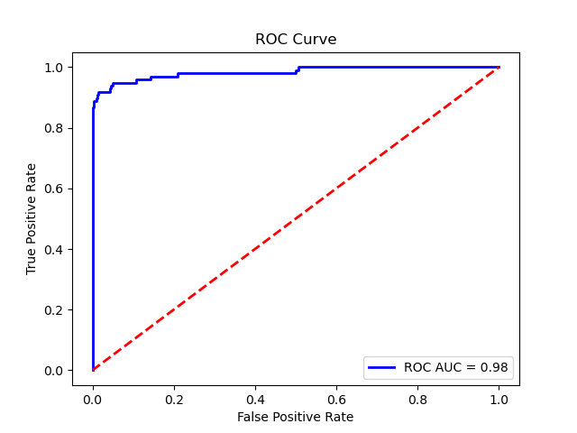
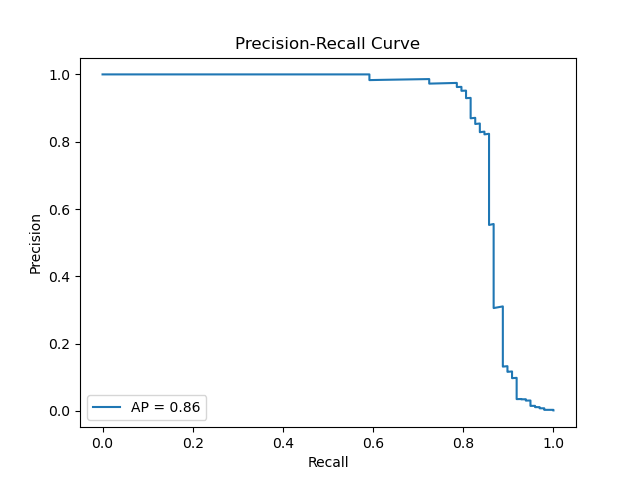

# Credit Card Fraud Detection Project

This project focuses on detecting fraudulent credit card transactions using machine learning. The dataset contains transactions with 492 frauds out of 284,807 transactions, making it a highly imbalanced classification problem.

## Dataset

The dataset contains 284,807 transactions with 31 features:
- **Time**: Number of seconds elapsed between each transaction and the first transaction
- **V1-V28**: Principal components obtained with PCA (anonymized for privacy)
- **Amount**: Transaction amount
- **Class**: Target variable (1 for fraud, 0 for legitimate)

### Source
The dataset was obtained from Kaggle: https://www.kaggle.com/datasets/nishipatkar/credit-card-details/data

### Key Characteristics
- Highly imbalanced dataset (0.1727% fraud cases)
- Features V1-V28 are scaled and anonymized
- Time and Amount features are not scaled

## Methodology

### Data Preprocessing
1. **Log Transformation**: Applied to the 'Amount' feature to handle its skewed distribution
2. **Data Splitting**: Split into train (60%), validation (20%), and test (20%) sets with stratification
3. **Class Balancing**: Applied SMOTE oversampling and random undersampling to handle class imbalance

### Models Evaluated
1. **Logistic Regression** (Baseline)
2. **XGBoost**
3. **LightGBM**
4. **Random Forest**

### Hyperparameter Tuning
- Used RandomizedSearchCV for XGBoost and LightGBM
- Optimized for F1-score with 5-fold cross-validation
- Balanced class weights to handle imbalanced data

### Best Performing Model
LightGBM with tuned hyperparameters achieved the best performance:
- Precision: 0.93
- Recall: 0.82
- F1-Score: 0.87
- AUC: 0.98

## Results

### Performance Metrics
| Model | Precision | Recall | F1-Score | AUC |
|-------|-----------|--------|----------|-----|
| Logistic Regression | 0.07 | 0.90 | 0.13 | 0.95 |
| XGBoost | 0.91 | 0.82 | 0.86 | 0.96 |
| LightGBM | 0.93 | 0.82 | 0.86 | 0.98 |
| Random Forest | 0.96 | 0.77 | 0.85 | 0.94 |

### Key Features
The top 5 important features for fraud detection were:
1. V8
2. V14
3. V4
4. V12
5. V1

## Streamlit Application

A Streamlit web application is included that allows real-time fraud prediction using the trained LightGBM model. Users can input transaction details (Time, V1-V28, Amount) and get an instant fraud prediction.

### How to Run
```bash
pip install -r requirements.txt
streamlit run app.py
```

### Features
- Input form for all 30 transaction features
- Real-time fraud prediction
- Automatic log transformation of Amount feature

## Files in Repository
- `creditcard.csv`: Original dataset
- `credit_card_fraud_notebook.ipynb`: Full analysis notebook
- `app.py`: Streamlit web application
- `lgb_model.pkl`: Trained LightGBM model
 - `requirements.txt`: Python package requirements

## Requirements
- streamlit
- lightgbm
- joblib

## Usage
1. Clone the repository
2. Install requirements
3. Run the Streamlit app: `streamlit run app.py`
4. Input transaction details to get fraud predictions

## Insights
1. Fraud transactions tend to have higher amounts on average
2. Class imbalance significantly affects model performance
3. Tree-based models (XGBoost, LightGBM) outperform linear models

### Visual Evaluation
Below are key model evaluation visuals included in the repository. They illustrate overall discrimination and precision/recall trade-offs for the best LightGBM model.

Note: reported metrics are calculated on the held-out test set using the saved model `lgb_model.pkl`.

- ROC Curve

	

- Precision-Recall Curve

	

---